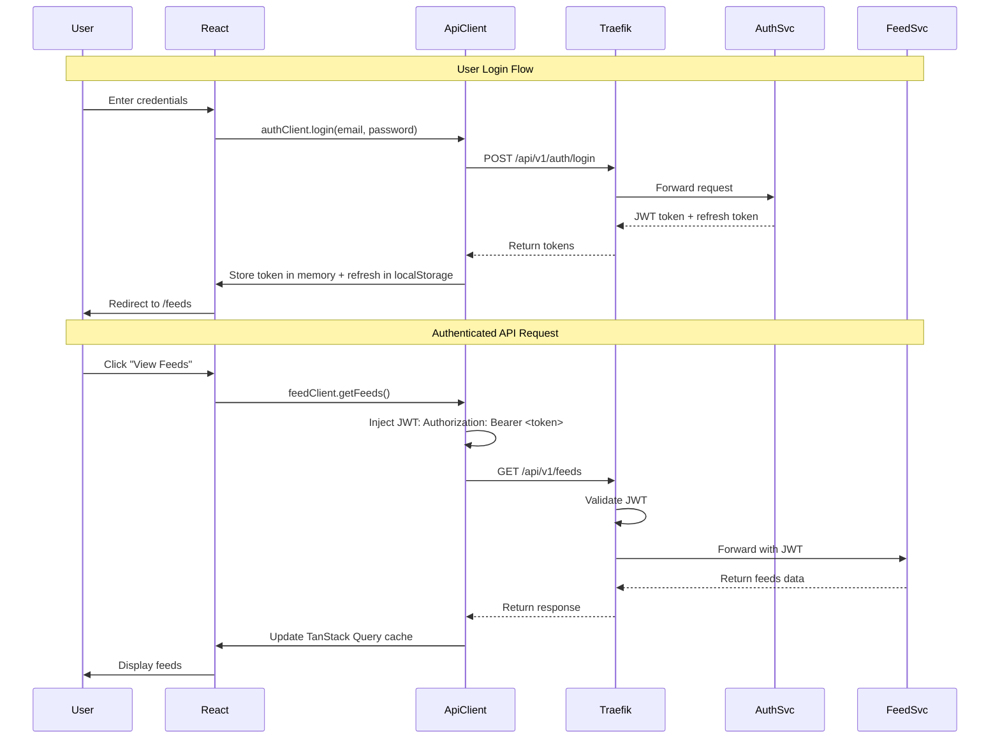
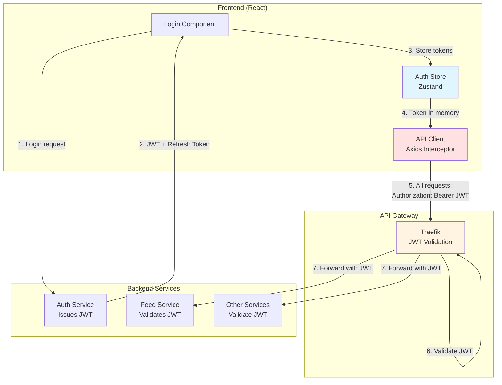
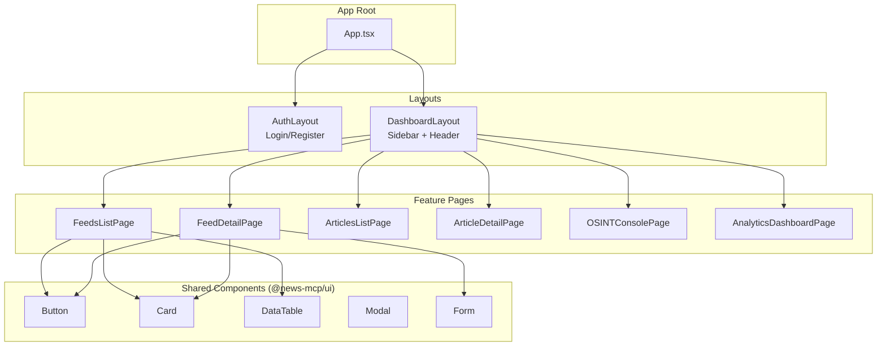
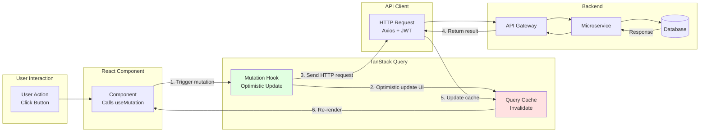
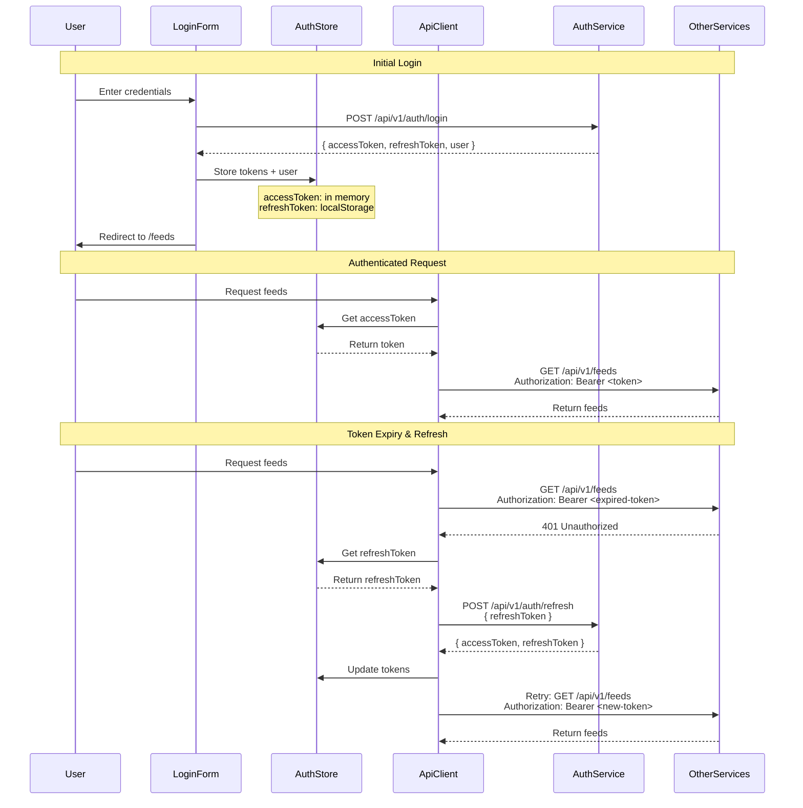
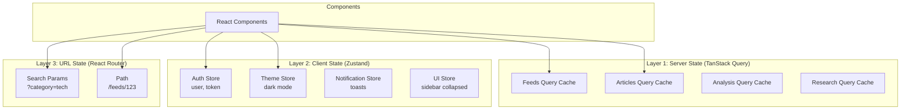

# Frontend Architecture - News Intelligence Platform

**Document Status**: Architecture Design
**Version**: 1.0
**Last Updated**: 2025-10-12
**Owner**: Frontend Architecture Team
**Reviewers**: System Architect, Backend Lead, DevOps

**Related Documents**:
- [System Overview](/home/cytrex/userdocs/microservices-architecture/00-OVERVIEW/System-Overview.md)
- [Architecture Vision](/home/cytrex/userdocs/microservices-architecture/00-OVERVIEW/Architecture-Vision.md)
- [Frontend Concept Brainstorming](/home/cytrex/news-microservices/frontend-workspace/FRONTEND_CONCEPT_BRAINSTORMING.md)
- [Frontend Decision Summary](/home/cytrex/news-microservices/frontend-workspace/FRONTEND_DECISION_SUMMARY.md)

---

## Table of Contents

- [Executive Summary](#executive-summary)
- [Architecture Overview](#architecture-overview)
- [Technology Stack Decisions](#technology-stack-decisions)
- [Architecture Diagrams](#architecture-diagrams)
- [Component Structure](#component-structure)
- [Authentication & Authorization](#authentication--authorization)
- [API Gateway Integration](#api-gateway-integration)
- [State Management Strategy](#state-management-strategy)
- [Routing Strategy](#routing-strategy)
- [Migration Strategy](#migration-strategy)
- [Performance & Optimization](#performance--optimization)
- [Security Architecture](#security-architecture)
- [Development Workflow](#development-workflow)

---

## Executive Summary

### Architecture Decision

The News Intelligence Platform frontend will use a **Hybrid Modular Monolith** architecture that provides the speed of a single-page application with the flexibility to extract modules into micro-frontends as needed.

### Key Decisions

| Decision Area | Choice | Rationale |
|--------------|--------|-----------|
| **Architecture** | Hybrid Modular Monolith (Monorepo) | Fast initial development, future micro-frontend ready |
| **Framework** | React 18 + Vite 5 + TypeScript 5 | Best ecosystem, fastest builds, type safety |
| **State Management** | TanStack Query (server) + Zustand (client) | Optimal server/client state separation |
| **UI Library** | shadcn/ui + TailwindCSS | Full customization, excellent accessibility |
| **Testing** | Vitest + Playwright + React Testing Library | Fast, reliable, comprehensive |
| **API Communication** | REST + Server-Sent Events (SSE) | Proven patterns, real-time updates |
| **Authentication** | JWT tokens + Refresh token pattern | Secure, stateless, scalable |

### Architecture Benefits

✅ **Fast Development**: Single deployment artifact, shared code, minimal overhead
✅ **Independent Teams**: Feature-based modules enable parallel development
✅ **Future-Proof**: Can extract to micro-frontends via Module Federation
✅ **Type Safety**: End-to-end TypeScript from API to UI
✅ **Performance**: Code splitting, lazy loading, optimistic updates
✅ **Scalability**: Supports 1,000+ concurrent users, 100,000+ articles

---

## Architecture Overview

### High-Level Architecture

```mermaid
graph TB
    subgraph "User Layer"
        BROWSER[Web Browser<br/>Desktop/Mobile]
        TELEGRAM[Telegram Bot<br/>Mobile Notifications]
    end

    subgraph "Frontend Application"
        SPA[React SPA<br/>Port 3000]

        subgraph "Feature Modules"
            AUTH_MOD[Auth Module]
            FEEDS_MOD[Feeds Module]
            ARTICLES_MOD[Articles Module]
            ANALYSIS_MOD[Analysis Module]
            RESEARCH_MOD[Research Module]
            OSINT_MOD[OSINT Module]
            SEARCH_MOD[Search Module]
            ANALYTICS_MOD[Analytics Module]
            NOTIFY_MOD[Notifications Module]
        end

        subgraph "Shared Packages"
            UI_PKG[@news-mcp/ui<br/>Component Library]
            API_PKG[@news-mcp/api<br/>API Client + Hooks]
            STATE_PKG[@news-mcp/state<br/>Global State]
            UTILS_PKG[@news-mcp/utils<br/>Utilities]
        end
    end

    subgraph "API Gateway Layer"
        TRAEFIK[Traefik<br/>API Gateway<br/>Port 80/443]
    end

    subgraph "Backend Microservices"
        AUTH_SVC[Auth Service<br/>Port 8000]
        FEED_SVC[Feed Service<br/>Port 8001]
        ANALYSIS_SVC[Content Analysis<br/>Port 8002]
        RESEARCH_SVC[Research Service<br/>Port 8003]
        OSINT_SVC[OSINT Service<br/>Port 8004]
        NOTIFY_SVC[Notification Service<br/>Port 8005]
        SEARCH_SVC[Search Service<br/>Port 8006]
        ANALYTICS_SVC[Analytics Service<br/>Port 8007]
    end

    BROWSER --> SPA
    TELEGRAM --> NOTIFY_SVC

    SPA --> AUTH_MOD
    SPA --> FEEDS_MOD
    SPA --> ARTICLES_MOD
    SPA --> ANALYSIS_MOD
    SPA --> RESEARCH_MOD
    SPA --> OSINT_MOD
    SPA --> SEARCH_MOD
    SPA --> ANALYTICS_MOD
    SPA --> NOTIFY_MOD

    AUTH_MOD --> UI_PKG
    AUTH_MOD --> API_PKG
    FEEDS_MOD --> UI_PKG
    FEEDS_MOD --> API_PKG
    ARTICLES_MOD --> UI_PKG
    ARTICLES_MOD --> API_PKG

    API_PKG --> TRAEFIK

    TRAEFIK --> AUTH_SVC
    TRAEFIK --> FEED_SVC
    TRAEFIK --> ANALYSIS_SVC
    TRAEFIK --> RESEARCH_SVC
    TRAEFIK --> OSINT_SVC
    TRAEFIK --> NOTIFY_SVC
    TRAEFIK --> SEARCH_SVC
    TRAEFIK --> ANALYTICS_SVC
```

### Key Characteristics

| Characteristic | Implementation |
|----------------|----------------|
| **Architecture Pattern** | Modular Monolith with feature modules |
| **Deployment** | Single-page application (SPA), static assets |
| **Communication** | REST API + Server-Sent Events for real-time |
| **State Management** | Server state (TanStack Query) + Client state (Zustand) + URL state (React Router) |
| **Code Organization** | Monorepo with Turborepo for build orchestration |
| **Module Boundaries** | Feature-based (by microservice domain) |

---

## Technology Stack Decisions

### Core Framework: React + Vite + TypeScript

**Decision**: Use React 18 with Vite 5 and TypeScript 5

**Rationale**:
- **React 18**: Concurrent features, Suspense, largest ecosystem
- **Vite 5**: Lightning-fast HMR (50-100ms), instant server start, ESM-first
- **TypeScript 5**: Type safety, IntelliSense, refactoring confidence

**Alternatives Considered**:
- ❌ **Next.js**: Overkill for authenticated SPA (no SEO benefits, SSR unnecessary)
- ❌ **Vue 3**: Smaller ecosystem, harder to find developers
- ❌ **Svelte**: Too niche, limited enterprise adoption

### State Management: TanStack Query + Zustand

**Decision**: Three-layer state management

```typescript
// Layer 1: Server State (TanStack Query v5)
const { data: feeds } = useQuery({
  queryKey: ['feeds'],
  queryFn: () => feedClient.getFeeds(),
  staleTime: 60_000, // Cache 60s
});

// Layer 2: Client State (Zustand)
const useAuthStore = create<AuthState>((set) => ({
  user: null,
  token: null,
  login: (user, token) => set({ user, token }),
  logout: () => set({ user: null, token: null }),
}));

// Layer 3: URL State (React Router 6)
const [searchParams, setSearchParams] = useSearchParams();
const category = searchParams.get('category');
```

**Rationale**:
- **TanStack Query**: Best-in-class server state management (caching, refetching, optimistic updates)
- **Zustand**: Minimal boilerplate, no Context providers, excellent TypeScript support
- **React Router**: URL as single source of truth for navigation state

**Alternatives Considered**:
- ❌ **Redux Toolkit**: Too much boilerplate for our needs
- ❌ **Recoil/Jotai**: Atomic state unnecessary complexity
- ❌ **Context API alone**: Performance issues with large state trees

### UI Components: shadcn/ui + TailwindCSS

**Decision**: shadcn/ui components with TailwindCSS styling

**Rationale**:
- **shadcn/ui**: Copy-paste components (no npm bloat), built on Radix UI (accessible), fully customizable
- **TailwindCSS**: Utility-first, small production bundle, dark mode built-in
- **No component lock-in**: Own the code, modify as needed

**Component Library Structure**:
```
packages/ui/
├── components/
│   ├── Button/           # Variants: primary, secondary, ghost, destructive
│   ├── Card/             # Variants: elevated, bordered, flat
│   ├── DataTable/        # Sortable, filterable, paginated
│   ├── Modal/            # Accessible dialog with Portal
│   ├── Form/             # Integrated with React Hook Form
│   └── ...
├── hooks/
│   ├── useToast.ts       # Toast notifications
│   ├── useTheme.ts       # Dark mode toggle
│   └── ...
└── themes/
    ├── tokens.ts         # Design tokens (colors, spacing, typography)
    └── tailwind.config.ts
```

**Alternatives Considered**:
- ❌ **Material-UI**: Large bundle size (500KB+), opinionated design
- ❌ **Ant Design**: Asian design language, not modern enough
- ❌ **Chakra UI**: Performance issues with CSS-in-JS

### API Client: Axios + TanStack Query

**Decision**: Type-safe API client with React hooks

```typescript
// packages/api/src/clients/FeedClient.ts
export class FeedClient extends BaseClient {
  async getFeeds(params?: GetFeedsParams): Promise<Feed[]> {
    return this.get<Feed[]>('/api/v1/feeds', { params });
  }

  async createFeed(data: CreateFeedDto): Promise<Feed> {
    return this.post<Feed>('/api/v1/feeds', data);
  }
}

// packages/api/src/hooks/useFeeds.ts
export function useFeeds(params?: GetFeedsParams) {
  return useQuery({
    queryKey: ['feeds', params],
    queryFn: () => feedClient.getFeeds(params),
    staleTime: 60_000,
  });
}

// Usage in component
const { data: feeds, isLoading, error } = useFeeds({ limit: 50 });
```

**Features**:
- ✅ Automatic JWT token injection
- ✅ Request/response interceptors
- ✅ Retry logic with exponential backoff
- ✅ Type-safe API contracts (TypeScript interfaces)
- ✅ React Query integration for caching

### Testing Stack: Vitest + Playwright + React Testing Library

**Decision**: Three-layer testing strategy

```typescript
// Unit Tests (Vitest + React Testing Library)
describe('Button', () => {
  it('renders with correct variant', () => {
    render(<Button variant="primary">Click me</Button>);
    expect(screen.getByRole('button')).toHaveClass('bg-primary');
  });
});

// E2E Tests (Playwright)
test('user can create a feed', async ({ page }) => {
  await page.goto('http://localhost:3000/feeds');
  await page.click('button:has-text("New Feed")');
  await page.fill('[name="url"]', 'https://example.com/feed.xml');
  await page.click('button[type="submit"]');
  await expect(page.locator('.toast')).toContainText('Feed created');
});
```

**Coverage Targets**:
- Unit tests: 80%+ code coverage
- Integration tests: All critical user flows
- E2E tests: Top 10 user journeys

---

## Architecture Diagrams

### 1. Frontend-to-Services Communication Flow



### 2. Authentication Token Propagation



### 3. Component Hierarchy



### 4. Data Flow Patterns



---

## Component Structure

### Module Organization (Feature-Based)

Each microservice maps to a frontend feature module:

```
apps/main-app/src/features/
├── auth/
│   ├── pages/
│   │   ├── LoginPage.tsx
│   │   ├── RegisterPage.tsx
│   │   └── ProfilePage.tsx
│   ├── components/
│   │   ├── LoginForm.tsx
│   │   ├── RegisterForm.tsx
│   │   └── UserAvatar.tsx
│   ├── hooks/
│   │   ├── useAuth.ts
│   │   ├── useLogin.ts
│   │   └── useLogout.ts
│   ├── store/
│   │   └── authStore.ts
│   └── index.ts
│
├── feeds/
│   ├── pages/
│   │   ├── FeedsListPage.tsx
│   │   ├── FeedDetailPage.tsx
│   │   ├── FeedCreatePage.tsx
│   │   └── FeedEditPage.tsx
│   ├── components/
│   │   ├── FeedCard.tsx
│   │   ├── FeedForm.tsx
│   │   ├── FeedHealthIndicator.tsx
│   │   └── FeedStatsChart.tsx
│   ├── hooks/
│   │   ├── useFeeds.ts
│   │   ├── useFeed.ts
│   │   ├── useCreateFeed.ts
│   │   └── useDeleteFeed.ts
│   └── index.ts
│
├── articles/
│   ├── pages/
│   │   ├── ArticlesListPage.tsx
│   │   ├── ArticleDetailPage.tsx
│   │   └── ArticleReaderPage.tsx
│   ├── components/
│   │   ├── ArticleCard.tsx
│   │   ├── ArticleList.tsx
│   │   ├── ArticleFilters.tsx
│   │   └── SentimentBadge.tsx
│   ├── hooks/
│   │   ├── useArticles.ts
│   │   └── useArticle.ts
│   └── index.ts
│
├── analysis/
│   ├── pages/
│   │   ├── AnalysisDashboardPage.tsx
│   │   └── AnalysisResultsPage.tsx
│   ├── components/
│   │   ├── SentimentChart.tsx
│   │   ├── EntityList.tsx
│   │   └── QualityScoreCard.tsx
│   ├── hooks/
│   │   ├── useAnalysis.ts
│   │   └── useRequestAnalysis.ts
│   └── index.ts
│
├── research/
│   ├── pages/
│   │   ├── ResearchHubPage.tsx
│   │   ├── ResearchTemplatesPage.tsx
│   │   └── ResearchHistoryPage.tsx
│   ├── components/
│   │   ├── ResearchForm.tsx
│   │   ├── TemplateCard.tsx
│   │   └── ResearchResultsViewer.tsx
│   ├── hooks/
│   │   ├── useResearch.ts
│   │   ├── useTemplates.ts
│   │   └── useExecuteResearch.ts
│   └── index.ts
│
├── osint/
│   ├── pages/
│   │   ├── OSINTConsolePage.tsx
│   │   ├── OSINTInstancesPage.tsx
│   │   └── OSINTAlertsPage.tsx
│   ├── components/
│   │   ├── OSINTTemplateGrid.tsx
│   │   ├── InstanceStatusCard.tsx
│   │   ├── AlertList.tsx
│   │   └── AnomalyChart.tsx
│   ├── hooks/
│   │   ├── useOSINTTemplates.ts
│   │   ├── useOSINTInstances.ts
│   │   └── useOSINTAlerts.ts
│   └── index.ts
│
├── search/
│   ├── pages/
│   │   ├── SearchPage.tsx
│   │   └── SavedSearchesPage.tsx
│   ├── components/
│   │   ├── SearchBar.tsx
│   │   ├── SearchFilters.tsx
│   │   ├── SearchResults.tsx
│   │   └── FacetedFilters.tsx
│   ├── hooks/
│   │   ├── useSearch.ts
│   │   └── useSavedSearches.ts
│   └── index.ts
│
├── analytics/
│   ├── pages/
│   │   ├── AnalyticsOverviewPage.tsx
│   │   ├── ServiceDashboardPage.tsx
│   │   └── CustomReportsPage.tsx
│   ├── components/
│   │   ├── MetricsCard.tsx
│   │   ├── TimeSeriesChart.tsx
│   │   ├── ServiceHealthGrid.tsx
│   │   └── ReportBuilder.tsx
│   ├── hooks/
│   │   ├── useMetrics.ts
│   │   └── useServiceHealth.ts
│   └── index.ts
│
└── notifications/
    ├── pages/
    │   ├── NotificationCenterPage.tsx
    │   └── NotificationPreferencesPage.tsx
    ├── components/
    │   ├── NotificationList.tsx
    │   ├── NotificationItem.tsx
    │   └── PreferencesForm.tsx
    ├── hooks/
    │   ├── useNotifications.ts
    │   └── useNotificationPreferences.ts
    └── index.ts
```

### Shared Packages Structure

```
packages/
├── ui/                    # Component Library
│   ├── components/
│   │   ├── Button/
│   │   ├── Card/
│   │   ├── DataTable/
│   │   ├── Form/
│   │   ├── Modal/
│   │   └── ...
│   ├── hooks/
│   ├── themes/
│   └── package.json
│
├── api/                   # API Client
│   ├── clients/
│   │   ├── BaseClient.ts
│   │   ├── AuthClient.ts
│   │   ├── FeedClient.ts
│   │   ├── AnalysisClient.ts
│   │   └── ...
│   ├── hooks/             # React Query hooks
│   │   ├── useAuth.ts
│   │   ├── useFeeds.ts
│   │   ├── useAnalysis.ts
│   │   └── ...
│   ├── types/             # API types
│   └── package.json
│
├── state/                 # Global State
│   ├── stores/
│   │   ├── authStore.ts
│   │   ├── themeStore.ts
│   │   └── notificationStore.ts
│   └── package.json
│
├── utils/                 # Utilities
│   ├── format.ts
│   ├── validation.ts
│   ├── date.ts
│   └── package.json
│
└── types/                 # Shared TypeScript types
    ├── domain/
    │   ├── Feed.ts
    │   ├── Article.ts
    │   ├── Analysis.ts
    │   └── ...
    └── package.json
```

---

## Authentication & Authorization

### Authentication Flow



### Token Management Strategy

**Storage Decision**:
```typescript
// Access Token: In-memory (React state) - More secure, lost on refresh
const [accessToken, setAccessToken] = useState<string | null>(null);

// Refresh Token: localStorage - Survives refresh, but vulnerable to XSS
localStorage.setItem('refreshToken', refreshToken);

// Alternative (more secure): httpOnly cookie for refresh token
// Requires backend to set: Set-Cookie: refreshToken=...; HttpOnly; Secure; SameSite=Strict
```

**Security Trade-offs**:
| Storage | Security | Persistence | XSS Risk | CSRF Risk |
|---------|----------|-------------|----------|-----------|
| **Memory (access token)** | High | No (lost on refresh) | Low | N/A |
| **localStorage (refresh)** | Medium | Yes | High | Low |
| **httpOnly Cookie** | High | Yes | None | Medium (mitigated with SameSite) |

**Recommended**:
- Access token in memory (15-minute expiry)
- Refresh token in httpOnly cookie (7-day expiry) if backend supports
- Fallback: Refresh token in localStorage with XSS protection (DOMPurify, CSP)

### Authorization: Role-Based Access Control (RBAC)

```typescript
// Define roles and permissions
enum Role {
  ADMIN = 'admin',
  EDITOR = 'editor',
  VIEWER = 'viewer',
}

interface User {
  id: string;
  email: string;
  roles: Role[];
  permissions: string[];
}

// Route protection
<Route
  path="/admin/*"
  element={
    <ProtectedRoute requiredRole={Role.ADMIN}>
      <AdminPanel />
    </ProtectedRoute>
  }
/>

// Component-level protection
{hasPermission('feeds:create') && (
  <Button onClick={handleCreateFeed}>New Feed</Button>
)}

// Hook-based authorization
const { hasRole, hasPermission } = useAuth();

if (hasRole(Role.ADMIN)) {
  // Show admin features
}
```

**Permission Matrix**:
| Feature | Viewer | Editor | Admin |
|---------|--------|--------|-------|
| View feeds | ✅ | ✅ | ✅ |
| Create/edit feeds | ❌ | ✅ | ✅ |
| Delete feeds | ❌ | ❌ | ✅ |
| View articles | ✅ | ✅ | ✅ |
| Trigger analysis | ❌ | ✅ | ✅ |
| View OSINT | ✅ | ✅ | ✅ |
| Create OSINT instances | ❌ | ✅ | ✅ |
| View analytics | ✅ | ✅ | ✅ |
| Manage users | ❌ | ❌ | ✅ |
| System config | ❌ | ❌ | ✅ |

---

## API Gateway Integration

### Traefik Routing Configuration

The frontend communicates with backend microservices through Traefik API Gateway:

```yaml
# traefik.yml (Traefik configuration)
http:
  routers:
    auth-service:
      rule: "PathPrefix(`/api/v1/auth`)"
      service: auth-service
      middlewares:
        - auth
        - rate-limit

    feed-service:
      rule: "PathPrefix(`/api/v1/feeds`)"
      service: feed-service
      middlewares:
        - auth
        - rate-limit

    content-analysis-service:
      rule: "PathPrefix(`/api/v1/analysis`)"
      service: content-analysis-service
      middlewares:
        - auth
        - rate-limit

    # ... (routes for all 8 services)

  services:
    auth-service:
      loadBalancer:
        servers:
          - url: "http://auth-service:8000"

    feed-service:
      loadBalancer:
        servers:
          - url: "http://feed-service:8001"

    # ... (load balancers for all services)

  middlewares:
    auth:
      plugin:
        jwt:
          secret: "${JWT_SECRET}"
          header: "Authorization"

    rate-limit:
      rateLimit:
        average: 100
        period: "1m"
```

### Frontend API Client Configuration

```typescript
// packages/api/src/config.ts
export const API_CONFIG = {
  baseURL: import.meta.env.VITE_API_GATEWAY_URL || 'http://localhost:80',
  timeout: 30000,
  headers: {
    'Content-Type': 'application/json',
  },
};

// packages/api/src/clients/BaseClient.ts
export class BaseClient {
  private axiosInstance: AxiosInstance;

  constructor(baseURL: string = API_CONFIG.baseURL) {
    this.axiosInstance = axios.create({
      baseURL,
      timeout: API_CONFIG.timeout,
      headers: API_CONFIG.headers,
    });

    // Request interceptor: Add JWT token
    this.axiosInstance.interceptors.request.use((config) => {
      const token = useAuthStore.getState().accessToken;
      if (token) {
        config.headers.Authorization = `Bearer ${token}`;
      }
      return config;
    });

    // Response interceptor: Handle 401 (token refresh)
    this.axiosInstance.interceptors.response.use(
      (response) => response,
      async (error) => {
        if (error.response?.status === 401) {
          const refreshed = await this.refreshToken();
          if (refreshed) {
            // Retry original request with new token
            return this.axiosInstance.request(error.config);
          } else {
            // Refresh failed, redirect to login
            useAuthStore.getState().logout();
            window.location.href = '/login';
          }
        }
        return Promise.reject(error);
      }
    );
  }

  private async refreshToken(): Promise<boolean> {
    try {
      const refreshToken = localStorage.getItem('refreshToken');
      const response = await axios.post(`${API_CONFIG.baseURL}/api/v1/auth/refresh`, {
        refreshToken,
      });
      const { accessToken, refreshToken: newRefreshToken } = response.data;
      useAuthStore.getState().updateTokens(accessToken, newRefreshToken);
      return true;
    } catch (error) {
      return false;
    }
  }

  protected async get<T>(url: string, config?: AxiosRequestConfig): Promise<T> {
    const response = await this.axiosInstance.get<T>(url, config);
    return response.data;
  }

  protected async post<T>(url: string, data?: any, config?: AxiosRequestConfig): Promise<T> {
    const response = await this.axiosInstance.post<T>(url, data, config);
    return response.data;
  }

  // ... (put, patch, delete methods)
}
```

### Service-Specific API Clients

```typescript
// packages/api/src/clients/FeedClient.ts
export class FeedClient extends BaseClient {
  async getFeeds(params?: GetFeedsParams): Promise<Feed[]> {
    return this.get<Feed[]>('/api/v1/feeds', { params });
  }

  async getFeed(id: string): Promise<Feed> {
    return this.get<Feed>(`/api/v1/feeds/${id}`);
  }

  async createFeed(data: CreateFeedDto): Promise<Feed> {
    return this.post<Feed>('/api/v1/feeds', data);
  }

  async updateFeed(id: string, data: UpdateFeedDto): Promise<Feed> {
    return this.patch<Feed>(`/api/v1/feeds/${id}`, data);
  }

  async deleteFeed(id: string): Promise<void> {
    return this.delete<void>(`/api/v1/feeds/${id}`);
  }

  async triggerFetch(id: string): Promise<{ jobId: string }> {
    return this.post<{ jobId: string }>(`/api/v1/feeds/${id}/fetch`);
  }
}

// Export singleton instance
export const feedClient = new FeedClient();
```

### React Query Integration

```typescript
// packages/api/src/hooks/useFeeds.ts
export function useFeeds(params?: GetFeedsParams) {
  return useQuery({
    queryKey: ['feeds', params],
    queryFn: () => feedClient.getFeeds(params),
    staleTime: 60_000, // Consider data fresh for 60s
    cacheTime: 300_000, // Keep in cache for 5min
  });
}

export function useCreateFeed() {
  const queryClient = useQueryClient();

  return useMutation({
    mutationFn: (data: CreateFeedDto) => feedClient.createFeed(data),
    onSuccess: (newFeed) => {
      // Optimistic update: Add to cache immediately
      queryClient.setQueryData<Feed[]>(['feeds'], (oldFeeds = []) => [
        ...oldFeeds,
        newFeed,
      ]);

      // Invalidate to trigger refetch (confirm optimistic update)
      queryClient.invalidateQueries({ queryKey: ['feeds'] });

      // Show success toast
      toast.success('Feed created successfully');
    },
    onError: (error) => {
      toast.error('Failed to create feed');
    },
  });
}
```

---

## State Management Strategy

### Three-Layer State Architecture



### State Management Rules

**When to use each layer**:

| State Type | Layer | Example | Rationale |
|-----------|-------|---------|-----------|
| **Data from backend** | TanStack Query | Feeds, articles, analysis | Automatic caching, refetching, optimistic updates |
| **Authentication** | Zustand | User, JWT token | Global, needs to persist across refreshes |
| **UI preferences** | Zustand | Dark mode, sidebar state | Global, but not from backend |
| **Temporary notifications** | Zustand | Toast messages | Global, ephemeral |
| **Filter state** | URL params | `?category=tech&sort=date` | Shareable, bookmarkable |
| **Active item** | URL path | `/feeds/123` | Deep linkable |

### TanStack Query Configuration

```typescript
// apps/main-app/src/config/queryClient.ts
export const queryClient = new QueryClient({
  defaultOptions: {
    queries: {
      staleTime: 60_000, // Data is fresh for 60s
      cacheTime: 300_000, // Keep in cache for 5min
      retry: 3,
      retryDelay: (attemptIndex) => Math.min(1000 * 2 ** attemptIndex, 30000),
      refetchOnWindowFocus: true,
      refetchOnReconnect: true,
    },
    mutations: {
      retry: 1,
      onError: (error) => {
        console.error('Mutation error:', error);
        toast.error('An error occurred. Please try again.');
      },
    },
  },
});
```

### Zustand Store Examples

```typescript
// packages/state/src/stores/authStore.ts
interface AuthState {
  user: User | null;
  accessToken: string | null;
  isAuthenticated: boolean;
  login: (user: User, accessToken: string, refreshToken: string) => void;
  logout: () => void;
  updateTokens: (accessToken: string, refreshToken: string) => void;
}

export const useAuthStore = create<AuthState>()(
  persist(
    (set) => ({
      user: null,
      accessToken: null,
      isAuthenticated: false,

      login: (user, accessToken, refreshToken) => {
        localStorage.setItem('refreshToken', refreshToken);
        set({ user, accessToken, isAuthenticated: true });
      },

      logout: () => {
        localStorage.removeItem('refreshToken');
        set({ user: null, accessToken: null, isAuthenticated: false });
      },

      updateTokens: (accessToken, refreshToken) => {
        localStorage.setItem('refreshToken', refreshToken);
        set({ accessToken });
      },
    }),
    {
      name: 'auth-storage',
      partialize: (state) => ({ user: state.user }), // Only persist user, not tokens
    }
  )
);

// packages/state/src/stores/themeStore.ts
interface ThemeState {
  theme: 'light' | 'dark' | 'system';
  setTheme: (theme: 'light' | 'dark' | 'system') => void;
}

export const useThemeStore = create<ThemeState>()(
  persist(
    (set) => ({
      theme: 'system',
      setTheme: (theme) => set({ theme }),
    }),
    {
      name: 'theme-storage',
    }
  )
);
```

---

## Routing Strategy

### React Router 6 Configuration

```typescript
// apps/main-app/src/router/index.tsx
import { createBrowserRouter, RouterProvider } from 'react-router-dom';

const router = createBrowserRouter([
  {
    path: '/',
    element: <RootLayout />,
    errorElement: <ErrorPage />,
    children: [
      {
        index: true,
        element: <Navigate to="/feeds" replace />,
      },
      {
        path: 'login',
        element: <LoginPage />,
      },
      {
        path: 'register',
        element: <RegisterPage />,
      },
      {
        element: <ProtectedRoute />, // Requires authentication
        children: [
          {
            element: <DashboardLayout />,
            children: [
              {
                path: 'feeds',
                children: [
                  {
                    index: true,
                    element: <FeedsListPage />,
                  },
                  {
                    path: 'new',
                    element: <FeedCreatePage />,
                  },
                  {
                    path: ':feedId',
                    element: <FeedDetailPage />,
                  },
                  {
                    path: ':feedId/edit',
                    element: <FeedEditPage />,
                  },
                ],
              },
              {
                path: 'articles',
                children: [
                  {
                    index: true,
                    element: <ArticlesListPage />,
                  },
                  {
                    path: ':articleId',
                    element: <ArticleDetailPage />,
                  },
                ],
              },
              {
                path: 'analysis',
                element: <AnalysisDashboardPage />,
              },
              {
                path: 'research',
                children: [
                  {
                    index: true,
                    element: <ResearchHubPage />,
                  },
                  {
                    path: 'templates',
                    element: <ResearchTemplatesPage />,
                  },
                  {
                    path: 'history',
                    element: <ResearchHistoryPage />,
                  },
                ],
              },
              {
                path: 'osint',
                children: [
                  {
                    index: true,
                    element: <OSINTConsolePage />,
                  },
                  {
                    path: 'instances',
                    element: <OSINTInstancesPage />,
                  },
                  {
                    path: 'alerts',
                    element: <OSINTAlertsPage />,
                  },
                ],
              },
              {
                path: 'search',
                element: <SearchPage />,
              },
              {
                path: 'analytics',
                children: [
                  {
                    index: true,
                    element: <AnalyticsOverviewPage />,
                  },
                  {
                    path: 'services/:serviceId',
                    element: <ServiceDashboardPage />,
                  },
                ],
              },
              {
                path: 'notifications',
                children: [
                  {
                    index: true,
                    element: <NotificationCenterPage />,
                  },
                  {
                    path: 'preferences',
                    element: <NotificationPreferencesPage />,
                  },
                ],
              },
            ],
          },
        ],
      },
      {
        path: '*',
        element: <NotFoundPage />,
      },
    ],
  },
]);

export function AppRouter() {
  return <RouterProvider router={router} />;
}
```

### Route Protection

```typescript
// apps/main-app/src/components/ProtectedRoute.tsx
export function ProtectedRoute({
  children,
  requiredRole
}: {
  children?: React.ReactNode;
  requiredRole?: Role;
}) {
  const { isAuthenticated, user } = useAuthStore();
  const location = useLocation();

  if (!isAuthenticated) {
    // Redirect to login, save intended destination
    return <Navigate to="/login" state={{ from: location }} replace />;
  }

  if (requiredRole && !user?.roles.includes(requiredRole)) {
    // User doesn't have required role
    return <Navigate to="/unauthorized" replace />;
  }

  return children || <Outlet />;
}
```

### URL State Management

```typescript
// Use search params for filter state
const [searchParams, setSearchParams] = useSearchParams();

// Get filter values from URL
const category = searchParams.get('category') || 'all';
const sortBy = searchParams.get('sort') || 'date';
const page = parseInt(searchParams.get('page') || '1');

// Update URL when filters change
const handleCategoryChange = (newCategory: string) => {
  setSearchParams(params => {
    params.set('category', newCategory);
    params.set('page', '1'); // Reset to page 1
    return params;
  });
};

// Result: URL like /articles?category=tech&sort=date&page=2 (shareable!)
```

---

## Migration Strategy from Monolith UI

### Current Monolith Frontend Stack

```
news-mcp/frontend/
├── templates/        # Jinja2 templates (server-rendered)
├── static/
│   ├── css/         # Custom CSS
│   ├── js/
│   │   ├── htmx.min.js
│   │   └── custom.js
│   └── components/  # Some React components (islands)
└── main.py          # FastAPI routes returning HTML
```

**Current Patterns**:
- HTMX for progressive enhancement (partial page updates)
- Server-rendered HTML with Jinja2 templates
- Sprinkled React components (article readers, charts)
- FastAPI endpoints return HTML fragments

### Migration Approach: Parallel Development

**Phase 1: Foundation (Month 1-2)**
```
Goal: Build new React frontend alongside monolith

Steps:
1. Create monorepo structure with Turborepo
2. Set up design system (shadcn/ui + TailwindCSS)
3. Build authentication module (login/register)
4. Create dashboard layout (sidebar, header, navigation)
5. Implement API client library with JWT support

Deployment: React app at https://app.news-intel.io (new subdomain)
Backend: Continue using monolith APIs at https://api.news-intel.io
```

**Phase 2: Feature Parity (Month 3-4)**
```
Goal: Migrate core features to React frontend

Priority 1 (Critical):
- Feeds management (list, create, edit, delete, health monitoring)
- Articles browser (list, filters, detail view)
- Content analysis dashboard (sentiment, entities)

Priority 2 (High):
- Research hub (templates, execution, history)
- OSINT console (templates, instances, alerts)

Priority 3 (Medium):
- Search interface
- Analytics dashboard
- Notification center

Approach: Build in parallel, users can opt-in to new UI
```

**Phase 3: Migration & Sunset (Month 5-6)**
```
Goal: Complete feature migration, deprecate monolith UI

Steps:
1. Implement remaining features (notifications, advanced analytics)
2. A/B test with 10% users on new UI
3. Gradual rollout: 25% → 50% → 75% → 100%
4. Monitor error rates, user feedback, performance
5. Deprecate monolith UI routes (keep API for backward compatibility)
6. Archive old frontend code

Final State:
- React SPA: https://app.news-intel.io (primary)
- API Gateway: https://api.news-intel.io (Traefik)
- Monolith API: Still running, consumed by React frontend
```

### Preserving Progressive Enhancement (HTMX Spirit)

While migrating from HTMX to React, we preserve progressive enhancement principles:

**1. Optimistic Updates** (HTMX-like instant feedback):
```typescript
// HTMX: hx-post="/api/feeds" hx-swap="outerHTML"
// React equivalent with TanStack Query
const { mutate: createFeed } = useCreateFeed();

const handleCreate = (data: CreateFeedDto) => {
  mutate(data, {
    onSuccess: (newFeed) => {
      // Instant UI update (optimistic)
      queryClient.setQueryData(['feeds'], (old: Feed[]) => [...old, newFeed]);
    },
  });
};
```

**2. Server-Sent Events** (real-time updates):
```typescript
// Real-time feed health updates (replaces HTMX polling)
useEffect(() => {
  const eventSource = new EventSource('/api/v1/feeds/health/stream');

  eventSource.onmessage = (event) => {
    const health = JSON.parse(event.data);
    queryClient.setQueryData(['feed-health', health.feedId], health);
  };

  return () => eventSource.close();
}, []);
```

**3. Progressive Loading** (Suspense boundaries):
```typescript
// Lazy load heavy components (like HTMX lazy loading)
const AnalyticsDashboard = lazy(() => import('./AnalyticsDashboard'));

<Suspense fallback={<Skeleton />}>
  <AnalyticsDashboard />
</Suspense>
```

---

## Performance & Optimization

### Code Splitting Strategy

```typescript
// Route-based code splitting (automatic with React Router)
const FeedsModule = lazy(() => import('./features/feeds'));
const ArticlesModule = lazy(() => import('./features/articles'));
const AnalysisModule = lazy(() => import('./features/analysis'));

// Component-level code splitting (heavy components only)
const OSINTChart = lazy(() => import('./components/OSINTChart')); // Chart.js bundle
const PDFViewer = lazy(() => import('./components/PDFViewer')); // PDF.js bundle
```

**Bundle Size Targets**:
| Bundle | Target Size | Lazy Load? |
|--------|-------------|------------|
| **Initial (vendor)** | <200KB gzipped | No |
| **Initial (app)** | <100KB gzipped | No |
| **Route chunks** | <50KB gzipped each | Yes |
| **Heavy components** | <100KB gzipped each | Yes |

### Virtual Scrolling

For large lists (10,000+ items), use virtual scrolling:

```typescript
import { useVirtualizer } from '@tanstack/react-virtual';

function ArticleList({ articles }: { articles: Article[] }) {
  const parentRef = useRef<HTMLDivElement>(null);

  const virtualizer = useVirtualizer({
    count: articles.length,
    getScrollElement: () => parentRef.current,
    estimateSize: () => 100, // Estimated row height
    overscan: 10, // Render 10 items above/below viewport
  });

  return (
    <div ref={parentRef} style={{ height: '600px', overflow: 'auto' }}>
      <div style={{ height: `${virtualizer.getTotalSize()}px`, position: 'relative' }}>
        {virtualizer.getVirtualItems().map((virtualRow) => (
          <div
            key={virtualRow.key}
            style={{
              position: 'absolute',
              top: 0,
              left: 0,
              width: '100%',
              height: `${virtualRow.size}px`,
              transform: `translateY(${virtualRow.start}px)`,
            }}
          >
            <ArticleCard article={articles[virtualRow.index]} />
          </div>
        ))}
      </div>
    </div>
  );
}
```

### Caching Strategy

```typescript
// TanStack Query caching
const queryClient = new QueryClient({
  defaultOptions: {
    queries: {
      // Feeds: Cache 60s (updated frequently)
      staleTime: 60_000,

      // Articles: Cache 5min (less volatile)
      staleTime: 300_000,

      // Analysis: Cache 15min (rarely changes)
      staleTime: 900_000,

      // Keep in cache for 30min even if unused
      cacheTime: 1_800_000,
    },
  },
});

// Service Worker caching (PWA)
// Cache static assets (JS, CSS, images) for offline access
self.addEventListener('install', (event) => {
  event.waitUntil(
    caches.open('app-v1').then((cache) => {
      return cache.addAll([
        '/',
        '/index.html',
        '/static/css/main.css',
        '/static/js/main.js',
        // ... (all static assets)
      ]);
    })
  );
});
```

### Performance Monitoring

```typescript
// Web Vitals tracking
import { getCLS, getFID, getFCP, getLCP, getTTFB } from 'web-vitals';

function sendToAnalytics({ name, value, id }) {
  // Send to analytics service (Posthog, Plausible, etc.)
  analytics.track('web_vital', {
    metric: name,
    value: Math.round(value),
    id,
  });
}

getCLS(sendToAnalytics);
getFID(sendToAnalytics);
getFCP(sendToAnalytics);
getLCP(sendToAnalytics);
getTTFB(sendToAnalytics);
```

**Performance Targets**:
| Metric | Target | Current (Monolith) | Status |
|--------|--------|-------------------|--------|
| **First Contentful Paint (FCP)** | <1.5s | ~2.5s | 🟡 Needs improvement |
| **Largest Contentful Paint (LCP)** | <2.5s | ~3.5s | 🟡 Needs improvement |
| **Time to Interactive (TTI)** | <3s | ~4s | 🟡 Needs improvement |
| **Cumulative Layout Shift (CLS)** | <0.1 | 0.05 | ✅ Good |
| **First Input Delay (FID)** | <100ms | 50ms | ✅ Good |
| **Lighthouse Score** | >90 | 75 | 🟡 Needs improvement |

---

## Security Architecture

### XSS Prevention

```typescript
// 1. React's built-in escaping (automatic)
<div>{userInput}</div> // Safe: React escapes HTML

// 2. DOMPurify for user-generated HTML
import DOMPurify from 'dompurify';

function ArticleContent({ html }: { html: string }) {
  const sanitizedHTML = DOMPurify.sanitize(html, {
    ALLOWED_TAGS: ['p', 'br', 'strong', 'em', 'a', 'ul', 'ol', 'li'],
    ALLOWED_ATTR: ['href', 'target'],
  });

  return <div dangerouslySetInnerHTML={{ __html: sanitizedHTML }} />;
}

// 3. Content Security Policy (CSP) headers
// Set in Traefik or Nginx:
// Content-Security-Policy: default-src 'self'; script-src 'self' 'unsafe-inline'; img-src 'self' data: https:;
```

### CSRF Protection

```typescript
// 1. SameSite cookies (for refresh tokens)
// Set by backend:
// Set-Cookie: refreshToken=...; SameSite=Strict; Secure; HttpOnly

// 2. CSRF token for state-changing operations
const csrfToken = document.querySelector('meta[name="csrf-token"]')?.getAttribute('content');

axios.post('/api/v1/feeds', data, {
  headers: {
    'X-CSRF-Token': csrfToken,
  },
});
```

### API Security

```typescript
// Rate limiting (handled by Traefik)
// Automatic: 100 req/min per user

// Input validation (Zod schemas)
import { z } from 'zod';

const createFeedSchema = z.object({
  url: z.string().url('Must be valid URL'),
  name: z.string().min(3, 'Name must be at least 3 characters'),
  category: z.enum(['news', 'tech', 'sports', 'politics']),
  fetchInterval: z.number().min(300, 'Minimum 5 minutes').max(86400, 'Maximum 24 hours'),
});

// Usage in form
const { register, handleSubmit, formState: { errors } } = useForm({
  resolver: zodResolver(createFeedSchema),
});
```

### Secrets Management

```bash
# Environment variables (never commit!)
# .env.local (gitignored)
VITE_API_GATEWAY_URL=http://localhost:80
VITE_SENTRY_DSN=https://abc123@sentry.io/12345
# ... (other non-secret config)

# Secrets in build pipeline (GitHub Actions)
# Injected at build time, not in repository
```

---

## Development Workflow

### Local Development Setup

```bash
# 1. Clone repository
git clone https://github.com/your-org/news-microservices-frontend.git
cd news-microservices-frontend

# 2. Install dependencies (uses Turborepo for caching)
npm install

# 3. Copy environment variables
cp .env.example .env.local
# Edit .env.local with your local API Gateway URL

# 4. Start development server
npm run dev
# Starts Vite dev server at http://localhost:3000
# Hot Module Replacement (HMR) enabled

# 5. Run tests
npm run test          # Unit tests (Vitest)
npm run test:e2e      # E2E tests (Playwright)
npm run test:coverage # Coverage report

# 6. Build for production
npm run build
npm run preview  # Preview production build locally
```

### Monorepo Scripts

```json
{
  "scripts": {
    "dev": "turbo run dev --parallel",
    "build": "turbo run build",
    "test": "turbo run test",
    "test:e2e": "playwright test",
    "lint": "turbo run lint",
    "typecheck": "turbo run typecheck",
    "format": "prettier --write \"**/*.{ts,tsx,md}\"",
    "clean": "turbo run clean && rm -rf node_modules"
  }
}
```

### CI/CD Pipeline

```yaml
# .github/workflows/ci.yml
name: CI/CD

on:
  push:
    branches: [main, develop]
  pull_request:
    branches: [main, develop]

jobs:
  test:
    runs-on: ubuntu-latest
    steps:
      - uses: actions/checkout@v3
      - uses: actions/setup-node@v3
        with:
          node-version: 20
          cache: 'npm'

      - run: npm ci
      - run: npm run lint
      - run: npm run typecheck
      - run: npm run test
      - run: npm run build

      # E2E tests
      - run: npx playwright install --with-deps
      - run: npm run test:e2e

      # Upload coverage
      - uses: codecov/codecov-action@v3
        with:
          files: ./coverage/coverage-final.json

  deploy-staging:
    needs: test
    if: github.ref == 'refs/heads/develop'
    runs-on: ubuntu-latest
    steps:
      - uses: actions/checkout@v3
      - run: npm ci
      - run: npm run build

      # Deploy to Vercel (staging)
      - uses: amondnet/vercel-action@v25
        with:
          vercel-token: ${{ secrets.VERCEL_TOKEN }}
          vercel-org-id: ${{ secrets.VERCEL_ORG_ID }}
          vercel-project-id: ${{ secrets.VERCEL_PROJECT_ID }}
          scope: ${{ secrets.VERCEL_ORG_ID }}

  deploy-production:
    needs: test
    if: github.ref == 'refs/heads/main'
    runs-on: ubuntu-latest
    steps:
      - uses: actions/checkout@v3
      - run: npm ci
      - run: npm run build

      # Deploy to production
      - uses: amondnet/vercel-action@v25
        with:
          vercel-token: ${{ secrets.VERCEL_TOKEN }}
          vercel-org-id: ${{ secrets.VERCEL_ORG_ID }}
          vercel-project-id: ${{ secrets.VERCEL_PROJECT_ID }}
          vercel-args: '--prod'
          scope: ${{ secrets.VERCEL_ORG_ID }}
```

---

## Conclusion

This frontend architecture provides a **modern, scalable, and maintainable** foundation for the News Intelligence Platform microservices transformation.

### Key Strengths

✅ **Modular Architecture**: Feature-based modules enable parallel team development
✅ **Type-Safe**: End-to-end TypeScript from API to UI components
✅ **Performance-First**: Code splitting, virtual scrolling, optimistic updates
✅ **Future-Proof**: Can extract to micro-frontends via Vite Module Federation
✅ **Developer Experience**: Fast HMR, excellent tooling, clear patterns
✅ **User Experience**: Responsive, accessible, real-time updates

### Implementation Roadmap

| Phase | Duration | Deliverables | Status |
|-------|----------|--------------|--------|
| **Phase 0: Setup** | Week 1 | Monorepo, design system, layouts | 📝 Planned |
| **Phase 1: Core** | Week 2-3 | Auth, Feeds, Articles | 📝 Planned |
| **Phase 2: Intelligence** | Week 4-5 | Analysis, Research, OSINT | 📝 Planned |
| **Phase 3: Supporting** | Week 6 | Search, Analytics, Notifications | 📝 Planned |
| **Phase 4: Testing** | Week 7-8 | E2E tests, performance, accessibility | 📝 Planned |
| **Phase 5: Deployment** | Week 9 | Production deployment, monitoring | 📝 Planned |

### Next Steps

1. ✅ **Review & Approve** this architecture with stakeholders
2. ⏳ **Create Monorepo Structure** using Turborepo template
3. ⏳ **Setup Design System** with shadcn/ui + TailwindCSS
4. ⏳ **Build Authentication Module** as proof-of-concept
5. ⏳ **Implement Feed Management** as first feature module

---

**Document Control**

| Version | Date | Author | Changes |
|---------|------|--------|---------|
| 1.0 | 2025-10-12 | System Architecture Designer | Initial frontend architecture design |

---

**Status**: ✅ Ready for Review
**Next Review Date**: 2025-10-19
**Owner**: Frontend Architecture Team
**Approvers**: Backend Lead, DevOps Lead, Product Manager

---

**End of Document**
