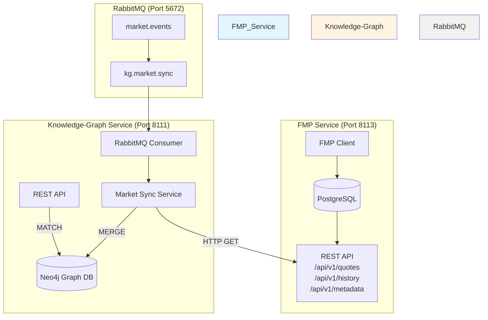
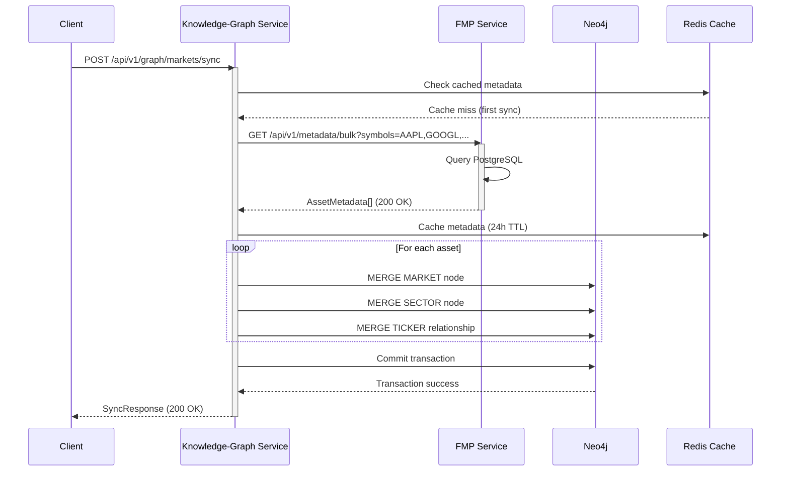
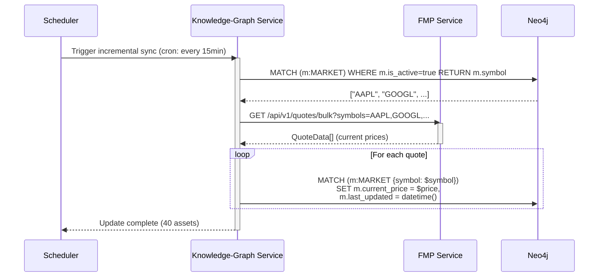
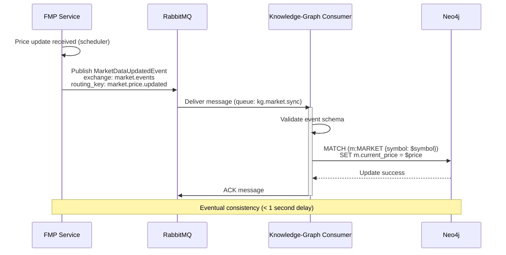

# FMP-Knowledge-Graph Integration Architecture Design

**Document Version:** 1.0.0
**Date:** 2025-11-16
**Status:** Design Phase
**Authors:** Backend Architecture Team

---

## Executive Summary

This document defines the integration architecture between the FMP Service (Financial Market Data Provider) and Knowledge-Graph Service (Neo4j Property Graph) for Phase 1: Market Sync Foundation. The integration enables financial market entities (stocks, forex, commodities, crypto) to be modeled as graph nodes with semantic relationships, providing the foundation for advanced financial intelligence queries.

**Key Objectives:**
- Ingest 40 financial assets from FMP Service into Neo4j knowledge graph
- Establish MARKET and SECTOR node types with indexed properties
- Create TICKER relationships between ORGANIZATION entities and MARKET nodes
- Implement idempotent sync operations (300 API calls/day limit)
- Enable graph queries for market data and entity relationships

**Integration Pattern:** Synchronous REST + Asynchronous Events (Phase 3)

---

## 1. System Overview

### 1.1 Service Architecture



### 1.2 Integration Scope (Phase 1)

**Assets to Integrate:**
- **Stocks:** 10 major indices (S&P 500, NASDAQ, Dow Jones, etc.)
- **Forex:** 10 currency pairs (EUR/USD, GBP/USD, USD/JPY, etc.)
- **Commodities:** 10 key commodities (Gold, Oil, Silver, etc.)
- **Crypto:** 10 major cryptocurrencies (BTC, ETH, etc.)

**Total:** 40 assets

---

## 2. Neo4j Schema Design

### 2.1 Node Types

#### 2.1.1 MARKET Node

Represents a tradable financial instrument (stock, forex, commodity, crypto).

**Properties:**
```cypher
(:MARKET {
    symbol: String!              // Primary identifier (e.g., "AAPL", "EURUSD", "GC", "BTC")
    name: String!                // Display name (e.g., "Apple Inc.", "Euro/US Dollar")
    asset_type: String!          // Enum: "STOCK", "FOREX", "COMMODITY", "CRYPTO"
    sector: String?              // Business sector (for stocks)
    industry: String?            // Industry classification (for stocks)
    exchange: String?            // Exchange (e.g., "NASDAQ", "NYSE")
    currency: String!            // Quote currency (e.g., "USD", "EUR")

    // Market Data (latest)
    current_price: Float?        // Latest price
    price_change: Float?         // Daily change
    price_change_percent: Float? // Daily change %
    volume: Integer?             // Trading volume
    market_cap: Integer?         // Market capitalization (stocks/crypto)

    // Metadata
    is_active: Boolean!          // Trading status
    first_seen: DateTime!        // First ingestion timestamp
    last_updated: DateTime!      // Last sync timestamp
    data_source: String!         // Always "FMP"

    // Forex-specific
    base_currency: String?       // For forex pairs (e.g., "EUR")
    quote_currency: String?      // For forex pairs (e.g., "USD")

    // Crypto-specific
    blockchain: String?          // Blockchain (e.g., "Ethereum")
    contract_address: String?    // Smart contract address
})
```

**Constraints & Indexes:**
```cypher
// Unique constraint (primary key)
CREATE CONSTRAINT market_symbol_unique IF NOT EXISTS
FOR (m:MARKET) REQUIRE m.symbol IS UNIQUE;

// Indexes for query performance
CREATE INDEX market_asset_type IF NOT EXISTS
FOR (m:MARKET) ON (m.asset_type);

CREATE INDEX market_sector IF NOT EXISTS
FOR (m:MARKET) ON (m.sector);

CREATE INDEX market_name_text IF NOT EXISTS
FOR (m:MARKET) ON (m.name);

// Composite index for common queries
CREATE INDEX market_type_active IF NOT EXISTS
FOR (m:MARKET) ON (m.asset_type, m.is_active);
```

#### 2.1.2 SECTOR Node

Represents a business sector classification (GICS, ICB, etc.).

**Properties:**
```cypher
(:SECTOR {
    sector_code: String!         // Primary identifier (e.g., "TECH", "FINANCE")
    sector_name: String!         // Display name (e.g., "Technology", "Financials")
    classification_system: String! // E.g., "GICS", "ICB", "FMP"
    description: String?         // Sector description

    // Metadata
    created_at: DateTime!
    updated_at: DateTime!
})
```

**Constraints:**
```cypher
CREATE CONSTRAINT sector_code_unique IF NOT EXISTS
FOR (s:SECTOR) REQUIRE s.sector_code IS UNIQUE;
```

### 2.2 Relationships

#### 2.2.1 TICKER Relationship

Connects ORGANIZATION entities to their tradable MARKET instruments.

**Structure:**
```cypher
(:ORGANIZATION)-[:TICKER {
    symbol: String!              // Trading symbol
    exchange: String?            // Primary exchange
    is_primary: Boolean!         // Primary listing flag
    listing_date: Date?          // IPO date

    // Confidence & Evidence
    confidence: Float!           // 1.0 for direct FMP mapping
    evidence: String?            // Source description

    // Metadata
    created_at: DateTime!
    last_verified: DateTime!
}]->(:MARKET)
```

**Example:**
```cypher
(:ORGANIZATION {name: "Apple Inc."})-[:TICKER {
    symbol: "AAPL",
    exchange: "NASDAQ",
    is_primary: true,
    confidence: 1.0,
    evidence: "FMP official mapping",
    created_at: datetime(),
    last_verified: datetime()
}]->(:MARKET {symbol: "AAPL", name: "Apple Inc.", asset_type: "STOCK"})
```

#### 2.2.2 BELONGS_TO_SECTOR Relationship

Connects MARKET nodes to their SECTOR classification.

**Structure:**
```cypher
(:MARKET)-[:BELONGS_TO_SECTOR {
    confidence: Float!           // Classification confidence
    classification_date: DateTime!
}]->(:SECTOR)
```

### 2.3 Idempotency Strategy

**MERGE Operations:**
All write operations use Neo4j `MERGE` to ensure idempotency:

```cypher
// Create or update MARKET node
MERGE (m:MARKET {symbol: $symbol})
ON CREATE SET
    m.name = $name,
    m.asset_type = $asset_type,
    m.first_seen = datetime(),
    m.is_active = true,
    m.data_source = 'FMP'
ON MATCH SET
    m.current_price = $current_price,
    m.price_change = $price_change,
    m.volume = $volume,
    m.last_updated = datetime()
RETURN m
```

**Deduplication Key:** `symbol` (unique constraint enforced)

---

## 3. Service Integration Points

### 3.1 HTTP Client Architecture

**Pattern:** Service Client with Circuit Breaker + Retry Logic

```python
# Knowledge-Graph Service: FMP Client
class FMPServiceClient:
    """HTTP client for FMP Service with resilience patterns."""

    def __init__(self):
        self.base_url = "http://fmp-service:8113"
        self.timeout = httpx.Timeout(10.0, connect=5.0)
        self.client = httpx.AsyncClient(
            timeout=self.timeout,
            limits=httpx.Limits(
                max_keepalive_connections=10,
                max_connections=20
            )
        )
        self.circuit_breaker = CircuitBreaker(
            failure_threshold=5,
            recovery_timeout=30
        )

    @retry(
        stop=stop_after_attempt(3),
        wait=wait_exponential(multiplier=1, min=2, max=10),
        retry=retry_if_exception_type((httpx.TimeoutException, httpx.NetworkError))
    )
    async def get_asset_metadata(self, symbols: List[str]) -> List[AssetMetadata]:
        """Fetch metadata for multiple assets."""
        return await self.circuit_breaker.call(
            self._fetch_metadata,
            symbols
        )

    async def _fetch_metadata(self, symbols: List[str]) -> List[AssetMetadata]:
        """Internal method for metadata fetching."""
        response = await self.client.get(
            f"{self.base_url}/api/v1/metadata/bulk",
            params={"symbols": ",".join(symbols)}
        )
        response.raise_for_status()
        return [AssetMetadata(**item) for item in response.json()]
```

### 3.2 Rate Limiting Strategy

**Constraint:** FMP API has 300 calls/day limit (free tier)

**Mitigation:**
1. **Batch Requests:** Fetch multiple assets in single API call
2. **Caching:** Cache FMP responses for 24 hours (market metadata rarely changes)
3. **Incremental Sync:** Only fetch changed data (price updates vs. full metadata)
4. **Request Quota Tracking:** Track daily API usage

**Implementation:**
```python
class RateLimiter:
    """Token bucket rate limiter for FMP API."""

    def __init__(self, max_calls: int = 300, period_seconds: int = 86400):
        self.max_calls = max_calls
        self.period_seconds = period_seconds
        self.tokens = max_calls
        self.last_reset = datetime.now()

    async def acquire(self, cost: int = 1) -> bool:
        """Acquire tokens for API call."""
        self._reset_if_needed()

        if self.tokens >= cost:
            self.tokens -= cost
            return True

        # Rate limit exceeded
        wait_time = self.period_seconds - (datetime.now() - self.last_reset).seconds
        raise RateLimitExceededError(f"Rate limit exceeded. Reset in {wait_time}s")

    def _reset_if_needed(self):
        """Reset tokens if period elapsed."""
        elapsed = (datetime.now() - self.last_reset).seconds
        if elapsed >= self.period_seconds:
            self.tokens = self.max_calls
            self.last_reset = datetime.now()
```

### 3.3 Error Handling & Retry Strategy

**Error Categories:**

| Error Type | HTTP Status | Retry Strategy | Fallback |
|------------|-------------|----------------|----------|
| Network Timeout | N/A | 3 retries, exponential backoff | Use cached data |
| Service Unavailable | 503 | Circuit breaker opens | Return stale data |
| Rate Limit Exceeded | 429 | Wait + retry after reset | Queue for next sync |
| Not Found | 404 | No retry | Mark asset as inactive |
| Server Error | 500 | 2 retries | Log error, continue sync |

**Exponential Backoff:**
- Initial delay: 2 seconds
- Max delay: 10 seconds
- Multiplier: 2x
- Jitter: ±20% randomization

### 3.4 Caching Strategy

**Cache Layers:**

1. **HTTP Response Cache (Redis):**
   - Key: `fmp:metadata:{symbol}`
   - TTL: 24 hours
   - Invalidation: Manual (on metadata update)

2. **Neo4j Query Cache:**
   - Materialized views for frequent queries
   - Refresh: After sync operations

**Cache Example:**
```python
class CacheService:
    """Redis cache for FMP responses."""

    async def get_cached_metadata(self, symbol: str) -> Optional[AssetMetadata]:
        """Get cached metadata."""
        cached = await self.redis.get(f"fmp:metadata:{symbol}")
        if cached:
            return AssetMetadata.parse_raw(cached)
        return None

    async def cache_metadata(self, symbol: str, metadata: AssetMetadata):
        """Cache metadata for 24 hours."""
        await self.redis.setex(
            f"fmp:metadata:{symbol}",
            86400,  # 24 hours
            metadata.json()
        )
```

---

## 4. API Contract Design

### 4.1 New Knowledge-Graph Endpoints

#### POST /api/v1/graph/markets/sync

**Purpose:** Trigger synchronous sync of market data from FMP Service to Neo4j.

**Request:**
```json
{
  "asset_types": ["STOCK", "FOREX", "COMMODITY", "CRYPTO"],  // Optional filter
  "symbols": ["AAPL", "EURUSD", "GC", "BTC"],  // Optional specific symbols
  "full_sync": false,  // false = incremental (prices only), true = full metadata
  "force_refresh": false  // Bypass cache
}
```

**Response:**
```json
{
  "sync_id": "sync_20251116_143022_abc123",
  "status": "completed",  // "completed", "in_progress", "failed", "partial"
  "assets_synced": 40,
  "assets_failed": 0,
  "nodes_created": 40,
  "nodes_updated": 0,
  "relationships_created": 35,
  "relationships_updated": 5,
  "duration_ms": 1245,
  "fmp_api_calls_used": 2,  // Track rate limit usage
  "errors": [],
  "timestamp": "2025-11-16T14:30:22Z"
}
```

**Error Responses:**
- `503 Service Unavailable`: FMP Service unreachable
- `429 Too Many Requests`: Rate limit exceeded
- `500 Internal Server Error`: Neo4j write failure

#### GET /api/v1/graph/markets

**Purpose:** Query market nodes from Neo4j graph.

**Query Parameters:**
```
?asset_type=STOCK           // Filter by asset type
&sector=Technology          // Filter by sector
&is_active=true            // Filter by active status
&search=apple              // Text search on name/symbol
&limit=50                  // Pagination limit (default: 50, max: 1000)
&offset=0                  // Pagination offset
```

**Response:**
```json
{
  "markets": [
    {
      "symbol": "AAPL",
      "name": "Apple Inc.",
      "asset_type": "STOCK",
      "sector": "Technology",
      "exchange": "NASDAQ",
      "current_price": 178.45,
      "price_change": 2.34,
      "price_change_percent": 1.33,
      "volume": 45678900,
      "market_cap": 2800000000000,
      "is_active": true,
      "last_updated": "2025-11-16T14:30:00Z",
      "relationships": {
        "organizations": 1,  // Count of linked ORGANIZATIONs
        "sectors": 1
      }
    }
  ],
  "total": 40,
  "limit": 50,
  "offset": 0,
  "query_time_ms": 23
}
```

#### GET /api/v1/graph/markets/{symbol}

**Purpose:** Get detailed market data with graph relationships.

**Response:**
```json
{
  "market": {
    "symbol": "AAPL",
    "name": "Apple Inc.",
    "asset_type": "STOCK",
    "sector": "Technology",
    "industry": "Consumer Electronics",
    "exchange": "NASDAQ",
    "currency": "USD",
    "current_price": 178.45,
    "price_change": 2.34,
    "price_change_percent": 1.33,
    "volume": 45678900,
    "market_cap": 2800000000000,
    "is_active": true,
    "first_seen": "2025-11-16T10:00:00Z",
    "last_updated": "2025-11-16T14:30:00Z",
    "data_source": "FMP"
  },
  "relationships": {
    "organizations": [
      {
        "name": "Apple Inc.",
        "type": "ORGANIZATION",
        "ticker": {
          "symbol": "AAPL",
          "exchange": "NASDAQ",
          "is_primary": true,
          "confidence": 1.0
        }
      }
    ],
    "sectors": [
      {
        "sector_code": "TECH",
        "sector_name": "Technology",
        "classification_system": "GICS"
      }
    ]
  },
  "graph_stats": {
    "total_connections": 2,
    "centrality_score": 0.85
  }
}
```

#### GET /api/v1/graph/markets/{symbol}/history

**Purpose:** Get historical price data (stored in FMP Service, aggregated view).

**Query Parameters:**
```
?from=2025-01-01
&to=2025-11-16
&interval=1d               // 1d, 1w, 1mo
```

**Response:**
```json
{
  "symbol": "AAPL",
  "history": [
    {
      "date": "2025-11-16",
      "open": 176.50,
      "high": 179.20,
      "low": 175.80,
      "close": 178.45,
      "volume": 45678900,
      "adj_close": 178.45
    }
  ],
  "total_records": 250,
  "data_source": "FMP"
}
```

### 4.2 Authentication & Authorization

**Pattern:** JWT Token (existing auth-service integration)

**Required Headers:**
```http
Authorization: Bearer <jwt_token>
```

**Permissions:**
- `markets:read` - Read market data
- `markets:write` - Trigger sync operations
- `markets:admin` - Manage market metadata

**Validation:**
```python
from app.middleware.auth import require_permissions

@router.post("/api/v1/graph/markets/sync")
@require_permissions(["markets:write"])
async def sync_markets(request: MarketSyncRequest, user: User = Depends(get_current_user)):
    """Only users with markets:write permission can sync."""
    pass
```

### 4.3 Input Validation

**Pydantic Schemas:**

```python
from pydantic import BaseModel, Field, validator
from typing import List, Optional
from enum import Enum

class AssetType(str, Enum):
    STOCK = "STOCK"
    FOREX = "FOREX"
    COMMODITY = "COMMODITY"
    CRYPTO = "CRYPTO"

class MarketSyncRequest(BaseModel):
    """Request schema for market sync."""
    asset_types: Optional[List[AssetType]] = None
    symbols: Optional[List[str]] = Field(None, max_items=100)
    full_sync: bool = False
    force_refresh: bool = False

    @validator('symbols')
    def validate_symbols(cls, v):
        """Validate symbol format."""
        if v:
            for symbol in v:
                if not symbol.isupper() or len(symbol) > 10:
                    raise ValueError(f"Invalid symbol: {symbol}")
        return v

class MarketResponse(BaseModel):
    """Response schema for market data."""
    symbol: str
    name: str
    asset_type: AssetType
    sector: Optional[str]
    current_price: Optional[float]
    # ... (rest of properties)

    class Config:
        from_attributes = True
```

---

## 5. Data Flow Patterns

### 5.1 Synchronous Initial Sync (Phase 1)

**Flow:** Knowledge-Graph Service pulls data from FMP Service via REST.



**Transaction Boundaries:**
- **Per-Asset Transaction:** Each MARKET node + relationships in single transaction
- **Rollback Strategy:** Failed asset sync logged, continues with remaining assets
- **Idempotency:** MERGE operations ensure no duplicates on retry

### 5.2 Incremental Price Update (Phase 1)

**Flow:** Update current prices without full metadata refresh.



**Optimization:**
- **Single FMP API Call:** Bulk quote endpoint (1 call for all 40 assets)
- **Batch Neo4j Writes:** Use parameterized batch query
- **Error Handling:** Failed quote update doesn't block other assets

### 5.3 Asynchronous Event-Driven Sync (Phase 3 - Future)

**Flow:** FMP Service publishes events, Knowledge-Graph Service consumes.



**Event Schema (Phase 3):**
```json
{
  "event_id": "evt_20251116_143022_abc123",
  "event_type": "MarketDataUpdated",
  "timestamp": "2025-11-16T14:30:22Z",
  "source": "fmp-service",
  "data": {
    "symbol": "AAPL",
    "asset_type": "STOCK",
    "current_price": 178.45,
    "price_change": 2.34,
    "volume": 45678900,
    "timestamp": "2025-11-16T14:30:00Z"
  },
  "metadata": {
    "correlation_id": "corr_abc123",
    "causation_id": "cause_xyz789"
  }
}
```

---

## 6. RabbitMQ Event Schema (Phase 3)

### 6.1 Exchange Topology

**Exchange:** `market.events` (topic exchange)

**Routing Keys:**
- `market.price.updated` - Price updates
- `market.metadata.updated` - Metadata changes
- `market.status.changed` - Active/inactive status
- `market.created` - New market added
- `market.deleted` - Market removed

**Queue Bindings:**
```
knowledge-graph-service:
  - Queue: kg.market.sync
  - Bindings: market.#
  - Prefetch: 10
  - DLQ: kg.market.sync.dlq
```

### 6.2 Event Message Format

**Base Event Schema:**
```json
{
  "$schema": "http://json-schema.org/draft-07/schema#",
  "type": "object",
  "required": ["event_id", "event_type", "timestamp", "source", "data"],
  "properties": {
    "event_id": {
      "type": "string",
      "description": "Unique event identifier (UUID v4)"
    },
    "event_type": {
      "type": "string",
      "enum": [
        "MarketDataUpdated",
        "MarketMetadataUpdated",
        "MarketStatusChanged",
        "MarketCreated",
        "MarketDeleted"
      ]
    },
    "timestamp": {
      "type": "string",
      "format": "date-time"
    },
    "source": {
      "type": "string",
      "const": "fmp-service"
    },
    "data": {
      "type": "object"
    },
    "metadata": {
      "type": "object",
      "properties": {
        "correlation_id": {"type": "string"},
        "causation_id": {"type": "string"},
        "user_id": {"type": "string"}
      }
    }
  }
}
```

**MarketDataUpdated Event:**
```json
{
  "event_id": "evt_550e8400-e29b-41d4-a716-446655440000",
  "event_type": "MarketDataUpdated",
  "timestamp": "2025-11-16T14:30:22.123Z",
  "source": "fmp-service",
  "data": {
    "symbol": "AAPL",
    "asset_type": "STOCK",
    "current_price": 178.45,
    "price_change": 2.34,
    "price_change_percent": 1.33,
    "volume": 45678900,
    "market_cap": 2800000000000,
    "timestamp": "2025-11-16T14:30:00Z"
  },
  "metadata": {
    "correlation_id": "corr_abc123",
    "causation_id": "scheduler_daily_update"
  }
}
```

### 6.3 Consumer Acknowledgment Strategy

**Pattern:** Manual ACK after successful Neo4j write

```python
async def handle_market_data_updated(message: MarketDataUpdatedEvent):
    """Handle market price update event."""
    try:
        # Update Neo4j
        await neo4j_service.execute_query("""
            MATCH (m:MARKET {symbol: $symbol})
            SET m.current_price = $price,
                m.last_updated = datetime($timestamp)
        """, parameters={
            "symbol": message.data.symbol,
            "price": message.data.current_price,
            "timestamp": message.timestamp
        })

        # ACK after successful write
        await channel.basic_ack(delivery_tag=message.delivery_tag)

    except Neo4jException as e:
        # NACK and requeue (transient DB failure)
        logger.error(f"Neo4j write failed: {e}")
        await channel.basic_nack(
            delivery_tag=message.delivery_tag,
            requeue=True
        )

    except ValidationError as e:
        # NACK without requeue (invalid message -> DLQ)
        logger.error(f"Invalid event schema: {e}")
        await channel.basic_nack(
            delivery_tag=message.delivery_tag,
            requeue=False
        )
```

**Dead Letter Queue (DLQ):**
- Invalid messages (schema validation failures)
- Permanent failures (e.g., missing MARKET node)
- Max retry exceeded (3 attempts)

**Monitoring:**
- Queue depth: Alert if > 100 messages
- Consumer lag: Alert if > 60 seconds
- DLQ depth: Alert if > 10 messages

---

## 7. Risk Analysis & Mitigation

### 7.1 Risk Matrix

| Risk | Probability | Impact | Severity | Mitigation |
|------|-------------|--------|----------|------------|
| FMP API rate limit exceeded | High | Medium | **HIGH** | Batch requests, caching, quota tracking |
| FMP Service unavailable | Medium | High | **HIGH** | Circuit breaker, fallback to cache, retry logic |
| Neo4j write failure | Low | High | **MEDIUM** | Transaction rollback, error logging, retry |
| Duplicate MARKET nodes | Medium | Medium | **MEDIUM** | UNIQUE constraints, MERGE operations |
| Data staleness (cache) | Medium | Low | **LOW** | 24h TTL, manual invalidation endpoint |
| Schema evolution breaking changes | Low | High | **MEDIUM** | Versioned API contracts, backward compatibility |
| Network partition | Low | High | **MEDIUM** | Timeout configuration, circuit breaker |

### 7.2 Mitigation Strategies

#### 7.2.1 Rate Limit Mitigation

**Problem:** FMP API has 300 calls/day limit

**Solution:**
1. **Batch Requests:** Single bulk endpoint fetches all 40 assets (1 call)
2. **Caching:** Cache metadata for 24 hours (reduces calls)
3. **Quota Tracking:** Monitor daily usage, alert at 80% threshold
4. **Incremental Sync:** Only fetch prices (not full metadata) for updates
5. **Off-Peak Scheduling:** Run full sync during low-traffic hours

**Implementation:**
```python
class QuotaTracker:
    """Track FMP API daily quota usage."""

    async def track_request(self, endpoint: str):
        """Increment quota counter."""
        key = f"fmp:quota:{date.today().isoformat()}"
        current = await redis.incr(key)
        await redis.expire(key, 86400)  # 24 hours

        if current >= 240:  # 80% of 300
            logger.warning(f"FMP quota at {current}/300 - nearing limit")

        if current >= 300:
            raise QuotaExceededError("FMP daily quota exceeded")
```

#### 7.2.2 Service Unavailability Mitigation

**Problem:** FMP Service might be temporarily unavailable

**Solution:**
1. **Circuit Breaker:** Open circuit after 5 consecutive failures
2. **Fallback to Cache:** Serve stale data from Redis (24h TTL)
3. **Exponential Backoff:** Retry with increasing delays
4. **Graceful Degradation:** Return partial results on timeout

**Circuit Breaker Configuration:**
```python
circuit_breaker = CircuitBreaker(
    failure_threshold=5,      # Open after 5 failures
    recovery_timeout=30,      # Try again after 30 seconds
    success_threshold=2,      # Close after 2 successes
    expected_exception=httpx.HTTPError
)
```

#### 7.2.3 Data Consistency Mitigation

**Problem:** Duplicate nodes or stale relationships

**Solution:**
1. **UNIQUE Constraints:** Enforce at database level
2. **MERGE Operations:** Idempotent writes
3. **Transactional Writes:** ACID guarantees per asset
4. **Validation:** Schema validation before Neo4j write

**Validation Example:**
```python
async def validate_market_data(data: dict) -> MarketData:
    """Validate market data before write."""
    try:
        market = MarketData(**data)

        # Business rules validation
        if market.current_price <= 0:
            raise ValueError("Price must be positive")

        if market.symbol != market.symbol.upper():
            raise ValueError("Symbol must be uppercase")

        return market

    except ValidationError as e:
        logger.error(f"Validation failed: {e}")
        raise
```

#### 7.2.4 Network Partition Mitigation

**Problem:** Network issues between services

**Solution:**
1. **Timeouts:** Connection timeout (5s), read timeout (10s)
2. **Retry Logic:** 3 attempts with exponential backoff
3. **Health Checks:** Periodic endpoint checks
4. **Observability:** Distributed tracing (correlation IDs)

**Timeout Configuration:**
```python
timeout = httpx.Timeout(
    10.0,           # Total request timeout
    connect=5.0,    # Connection timeout
    read=10.0,      # Read timeout
    write=5.0,      # Write timeout
    pool=1.0        # Pool acquisition timeout
)
```

---

## 8. Implementation Roadmap

### Phase 1: Market Sync Foundation (Current)

**Duration:** 2-3 days

**Tasks:**
1. ✅ Design Neo4j schema (this document)
2. ⏳ Create migration script (001_market_schema.cypher)
3. ⏳ Implement FMPServiceClient with circuit breaker
4. ⏳ Implement MarketSyncService
5. ⏳ Create REST endpoints (POST /sync, GET /markets, GET /markets/{symbol})
6. ⏳ Add rate limiting and caching
7. ⏳ Write integration tests
8. ⏳ Initial sync of 40 assets

**Success Criteria:**
- All 40 assets synced to Neo4j
- MARKET and SECTOR nodes created
- TICKER relationships established
- Query response time < 100ms
- FMP API calls < 5 per full sync

### Phase 2: Incremental Updates (Week 2)

**Tasks:**
1. Implement scheduled price updates (every 15 minutes)
2. Add cache invalidation logic
3. Optimize bulk update queries
4. Add Prometheus metrics
5. Create Grafana dashboard

**Success Criteria:**
- Price updates within 1 minute of FMP data
- < 2 FMP API calls per incremental update
- Update latency < 5 seconds

### Phase 3: Event-Driven Architecture (Week 3-4)

**Tasks:**
1. Implement RabbitMQ publisher in FMP Service
2. Implement RabbitMQ consumer in Knowledge-Graph Service
3. Define event schemas (JSON Schema)
4. Add DLQ handling
5. Implement consumer acknowledgment logic
6. Monitoring and alerting

**Success Criteria:**
- Event processing latency < 1 second
- Zero message loss (DLQ for failures)
- Consumer throughput > 100 events/second

---

## 9. Monitoring & Observability

### 9.1 Metrics (Prometheus)

**Knowledge-Graph Service Metrics:**

```python
# Sync operation metrics
kg_sync_total = Counter(
    'kg_market_sync_total',
    'Total market sync operations',
    ['status']  # success, failed, partial
)

kg_sync_duration_seconds = Histogram(
    'kg_market_sync_duration_seconds',
    'Market sync duration',
    buckets=[0.1, 0.5, 1, 2, 5, 10]
)

kg_sync_assets_total = Counter(
    'kg_market_sync_assets_total',
    'Total assets synced',
    ['asset_type']
)

# FMP client metrics
kg_fmp_requests_total = Counter(
    'kg_fmp_requests_total',
    'Total FMP API requests',
    ['endpoint', 'status']
)

kg_fmp_quota_used = Gauge(
    'kg_fmp_quota_used',
    'FMP API quota used today'
)

# Circuit breaker metrics
kg_circuit_breaker_state = Gauge(
    'kg_circuit_breaker_state',
    'Circuit breaker state (0=closed, 1=open, 2=half_open)',
    ['service']
)

# Neo4j metrics
kg_neo4j_write_duration_seconds = Histogram(
    'kg_neo4j_write_duration_seconds',
    'Neo4j write operation duration',
    ['operation']  # merge_market, merge_sector, merge_relationship
)
```

### 9.2 Logging

**Structured Logging Format:**

```json
{
  "timestamp": "2025-11-16T14:30:22.123Z",
  "level": "INFO",
  "service": "knowledge-graph-service",
  "correlation_id": "corr_abc123",
  "message": "Market sync completed",
  "context": {
    "sync_id": "sync_20251116_143022_abc123",
    "assets_synced": 40,
    "assets_failed": 0,
    "duration_ms": 1245,
    "fmp_api_calls": 2
  }
}
```

**Log Levels:**
- `DEBUG`: Detailed execution flow (development only)
- `INFO`: Sync operations, API calls, successful writes
- `WARNING`: Rate limit approaching, cache miss, retry attempts
- `ERROR`: FMP API errors, Neo4j write failures, validation errors
- `CRITICAL`: Circuit breaker open, service unavailable

### 9.3 Alerts

**Grafana Alerts:**

| Alert | Condition | Severity | Action |
|-------|-----------|----------|--------|
| FMP Quota Nearing Limit | quota_used >= 240 | Warning | Reduce sync frequency |
| FMP Service Unavailable | circuit_breaker_state == 1 | Critical | Check FMP Service health |
| Sync Failure Rate High | failure_rate > 10% (5min) | Critical | Investigate errors |
| Neo4j Write Latency High | p95_latency > 1s | Warning | Optimize queries |
| Market Data Staleness | last_sync > 1 hour | Warning | Trigger manual sync |

---

## 10. Security Considerations

### 10.1 API Key Management

**FMP API Key:**
- Stored in environment variable: `FMP_API_KEY`
- Never logged or exposed in responses
- Rotated quarterly
- Encrypted at rest (Kubernetes secrets)

**JWT Tokens:**
- Validated by auth-service middleware
- Scoped permissions (markets:read, markets:write)
- 1-hour expiration
- Refresh token rotation

### 10.2 Input Validation

**Validation Points:**
1. **API Request:** Pydantic schema validation
2. **FMP Response:** Schema validation before Neo4j write
3. **Neo4j Query:** Parameterized queries (prevent injection)
4. **Event Messages:** JSON Schema validation

**Example:**
```python
# Prevent Cypher injection
# ❌ UNSAFE (string interpolation)
cypher = f"MATCH (m:MARKET {{symbol: '{symbol}'}}) RETURN m"

# ✅ SAFE (parameterized query)
cypher = "MATCH (m:MARKET {symbol: $symbol}) RETURN m"
parameters = {"symbol": symbol}
```

### 10.3 Rate Limiting

**Per-User Rate Limits:**
- `markets:read` - 100 requests/minute
- `markets:write` - 10 requests/minute
- `markets:admin` - 50 requests/minute

**Implementation:**
```python
from slowapi import Limiter, _rate_limit_exceeded_handler
from slowapi.util import get_remote_address

limiter = Limiter(key_func=get_remote_address)

@router.get("/api/v1/graph/markets")
@limiter.limit("100/minute")
async def get_markets(request: Request):
    pass
```

---

## 11. Testing Strategy

### 11.1 Unit Tests

**Coverage Target:** 80%

**Test Cases:**
```python
# tests/services/test_market_sync_service.py
async def test_sync_single_asset():
    """Test syncing single asset to Neo4j."""
    service = MarketSyncService()
    result = await service.sync_asset("AAPL")

    assert result.success
    assert result.nodes_created == 1
    assert result.relationships_created >= 1

async def test_sync_duplicate_asset_idempotent():
    """Test MERGE idempotency."""
    service = MarketSyncService()

    # First sync
    result1 = await service.sync_asset("AAPL")

    # Second sync (should update, not create)
    result2 = await service.sync_asset("AAPL")

    assert result2.nodes_created == 0
    assert result2.nodes_updated == 1

async def test_fmp_client_rate_limit():
    """Test rate limiter blocks at quota."""
    client = FMPServiceClient()
    client.rate_limiter.tokens = 0

    with pytest.raises(RateLimitExceededError):
        await client.get_asset_metadata(["AAPL"])
```

### 11.2 Integration Tests

**Test Cases:**
```python
# tests/integration/test_fmp_kg_integration.py
async def test_full_sync_workflow():
    """Test complete sync workflow."""
    # 1. Trigger sync
    response = await client.post("/api/v1/graph/markets/sync", json={
        "symbols": ["AAPL", "GOOGL"],
        "full_sync": True
    })

    assert response.status_code == 200
    result = response.json()
    assert result["assets_synced"] == 2

    # 2. Verify Neo4j data
    markets = await client.get("/api/v1/graph/markets")
    assert len(markets.json()["markets"]) >= 2

    # 3. Verify relationships
    aapl = await client.get("/api/v1/graph/markets/AAPL")
    assert aapl.json()["relationships"]["organizations"] >= 1
```

### 11.3 Load Tests

**Scenarios:**
1. **Concurrent Sync:** 10 concurrent sync requests
2. **High Query Load:** 100 req/s on GET /markets endpoint
3. **Bulk Sync:** Sync all 40 assets in single request

**Performance Targets:**
- Sync 40 assets: < 5 seconds
- Query response (GET /markets): < 100ms (p95)
- Query response (GET /markets/{symbol}): < 50ms (p95)

---

## 12. Appendix

### 12.1 Neo4j Query Examples

**Find all markets in Technology sector:**
```cypher
MATCH (m:MARKET)-[:BELONGS_TO_SECTOR]->(s:SECTOR {sector_code: 'TECH'})
WHERE m.is_active = true
RETURN m.symbol, m.name, m.current_price
ORDER BY m.current_price DESC
LIMIT 10
```

**Find organizations with ticker symbols:**
```cypher
MATCH (org:ORGANIZATION)-[t:TICKER]->(m:MARKET)
WHERE m.asset_type = 'STOCK'
RETURN org.name, t.symbol, m.current_price, m.exchange
ORDER BY m.current_price DESC
```

**Calculate sector average price:**
```cypher
MATCH (m:MARKET)-[:BELONGS_TO_SECTOR]->(s:SECTOR)
WHERE m.is_active = true AND m.current_price IS NOT NULL
RETURN s.sector_name,
       count(m) AS market_count,
       avg(m.current_price) AS avg_price,
       sum(m.market_cap) AS total_market_cap
ORDER BY total_market_cap DESC
```

### 12.2 FMP Service API Reference

**Endpoint:** `GET /api/v1/metadata/bulk`

**Query Parameters:**
- `symbols` (string): Comma-separated list (e.g., "AAPL,GOOGL,MSFT")

**Response:**
```json
[
  {
    "symbol": "AAPL",
    "name": "Apple Inc.",
    "asset_type": "stock",
    "sector": "Technology",
    "industry": "Consumer Electronics",
    "exchange": "NASDAQ",
    "currency": "USD"
  }
]
```

### 12.3 Glossary

| Term | Definition |
|------|------------|
| **Asset Type** | Financial instrument category (STOCK, FOREX, COMMODITY, CRYPTO) |
| **Circuit Breaker** | Resilience pattern that fails fast when service unavailable |
| **GICS** | Global Industry Classification Standard (sector taxonomy) |
| **Idempotency** | Operation that produces same result when executed multiple times |
| **MERGE** | Neo4j operation that creates node if not exists, updates if exists |
| **Rate Limit** | Maximum API requests allowed per time period |
| **Ticker Symbol** | Unique stock identifier (e.g., AAPL for Apple) |

---

## Document Control

**Version History:**

| Version | Date | Author | Changes |
|---------|------|--------|---------|
| 1.0.0 | 2025-11-16 | Backend Architecture Team | Initial design document |

**Review Status:** ✅ Pending Review

**Approvers:**
- [ ] Technical Lead
- [ ] Product Owner
- [ ] Security Team

**Next Steps:**
1. Review and approve design
2. Create Neo4j migration script
3. Implement service integration
4. Execute Phase 1 roadmap
